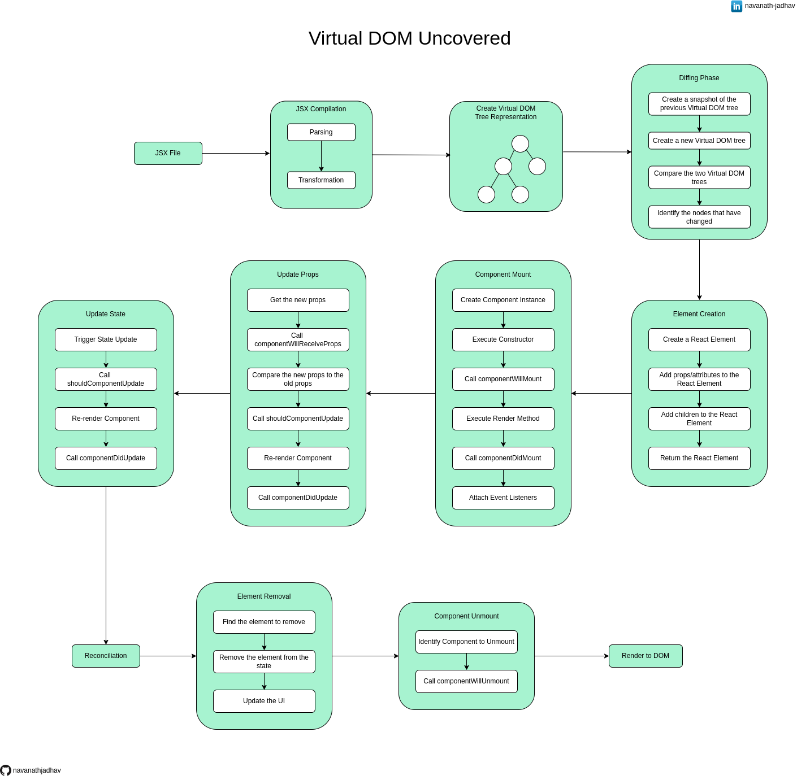

# React Virtual DOM Uncovered

This repository provides a detailed flow description of the steps involved in React's Virtual DOM, offering a comprehensive understanding of its rendering mechanism. It outlines the major stages and methodologies from JSX to actual DOM rendering, ensuring clarity in the React Virtual DOM workflow.

## Give a Star ⭐

If you liked this project or found it helpful then please give it a star.
Thanks.

## Workflow diagram

## Download

Get a [PDF version](./React_Virtual_DOM_Uncovered.pdf).

## JSX Compilation Phase

The JSX code is compiled into regular JavaScript code using a transpiler like Babel. This step converts JSX into function calls that create React elements.

1.  Parsing
    The tokenized JSX code is parsed into an Abstract Syntax Tree (AST). The AST represents the hierarchical structure of the code and allows for easier manipulation and analysis.

2.  Transformation
    The JSX syntax is transformed into regular JavaScript code using a transpiler like Babel. This involves converting JSX elements and attributes into function calls that create React elements.

3.  Minification
    It refers to the process of removing unnecessary characters, such as whitespace, comments, and line breaks, from the generated JavaScript code. The purpose of minification is to reduce the file size and improve the overall performance of the application.

## Create Virtual DOM Tree Representation

The compiled JSX code is used to create a lightweight in-memory representation of the DOM called the Virtual DOM tree. This tree consists of React elements that correspond to the components and their structure in the JSX code.

## Diffing Phase

When a component's state or props change, a new Virtual DOM tree is created. React performs a diffing (or reconciliation) process by comparing the new Virtual DOM tree with the previous one to identify the differences between them efficiently.

1.  Create snapshot of the previous Virtual DOM Tree
    The previous Virtual DOM tree, generated from the previous render, is available for comparison.

2.  Create a new Virtual DOM tree
    A new Virtual DOM tree is created based on the current state and props of the components, representing the desired structure and content of the updated UI.

3.  Compare the two Virtual DOM trees
    The elements in the previous Virtual DOM tree are compared to the corresponding elements in the new Virtual DOM tree. This involves checking their types, keys, and attributes.

4.  Identify the nodes that have changed
    The elements and nodes are identified

## Element creation

During the diffing phase, if a new element is encountered in the Virtual DOM tree or a component is added, React creates an actual DOM element based on the element type (e.g., div, span) or custom component.

1.  Create a React element
    React creates a new virtual element object representing the element. The virtual element holds information about the element's type, attributes, and children.

2.  Add props/attributes to the React element
    If the element has attributes specified in the JSX code, React assigns those attributes to the virtual element, including event handlers, styles, class names, and other properties.

3.  Add children to the React element
    If the element has children specified in the JSX code, React recursively creates virtual elements for each child and assigns them as children of the current element.

4.  Return the React element
    Return the element

## Component Mount

When a component is encountered during the diffing phase, React triggers the mounting process. This involves calling the component's lifecycle methods (e.g., componentDidMount) and setting up event listeners or subscriptions.

1.  Create component instance
    When a component is first rendered or added to the Virtual DOM, a new instance of that component is created.

2.  Execute constructor
    The constructor of the component is executed, allowing for initialization tasks such as setting the initial state or binding event handlers.

3.  Call componentWillMount
    The componentWillMount lifecycle method is called. This method allows the component to perform any necessary setup tasks before it is mounted.

4.  Execute render method
    The render method of the component is called, returning the JSX code or React elements that define the structure and content of the component.

5.  Call componentDidMount
    After the component is mounted and the corresponding virtual elements are created, the componentDidMount lifecycle method is called. This method allows the component to perform initialization tasks that require access to the actual DOM, such as setting up event listeners or making API calls.

6.  Attach Event Listeners
    If the component has event listeners specified in the JSX code or in the componentDidMount method, those event listeners are attached to the appropriate DOM nodes.

## Update props

If the props of a component have changed during the diffing phase, React updates the component by calling the appropriate lifecycle methods (e.g., componentDidUpdate) and passing the new props.

1.  Get the new props
    When a component receives new props, either from a parent component or from an external source, the update props phase is triggered.

2.  Call componentWillReceiveProps
    Before updating the props, the componentWillReceiveProps lifecycle method is called. This method allows the component to perform any necessary tasks before the props are updated.

3.  Compare new props to the old props
    The new props are compared to the previous props to determine if any changes have occurred. React performs a shallow comparison of the props by checking the values of each prop.

4.  Call shouldComponentUpdate
    If the component needs to be updated, the shouldComponentUpdate lifecycle method is called. This method allows the component to control whether the update should proceed. By default, React re-renders the component if there are prop changes, but this method can be implemented to optimize performance by selectively allowing or preventing updates.

5.  Re-render component
    If the component is allowed to update, the render method is called again to generate the updated JSX code or React elements that define the new structure and content of the component.

6.  Call componentDidUpdate
    After the component is updated and the corresponding virtual elements are created, the componentDidUpdate lifecycle method is called. This method allows the component to perform any necessary tasks after the update, such as accessing the updated DOM or triggering side effects.

## Update state

If the state of a component has changed during the diffing phase, React updates the component by calling the appropriate lifecycle methods (e.g., componentDidUpdate) and passing the new state.

1.  Trigger state update
    When a component's state is updated, either by calling the setState method or by using the useState hook, the update state phase is triggered.

2.  Call shouldComponentUpdate
    Before updating the state, the shouldComponentUpdate lifecycle method is called. This method allows the component to control whether the update should proceed. By default, React re-renders the component whenever the state changes, but this method can be implemented to optimize performance by selectively allowing or preventing updates.

3.  Re-render component
    If the component is allowed to update, the render method is called again to generate the updated JSX code or React elements that define the new structure and content of the component.

4.  Call componentDidUpdate
    After the component is updated and the corresponding virtual elements are created, the componentDidUpdate lifecycle method is called. This method allows the component to perform any necessary tasks after the update, such as accessing the updated DOM or triggering side effects.

## Reconciliation

React generates a set of instructions based on the differences found during the reconciliation phase. These instructions describe the operations needed to update the actual DOM and bring it in sync with the new Virtual DOM.

## Element Removal

React identifies the element in the previous Virtual DOM tree that needs to be removed.

1.  Find the element to remove
    The need for element removal arises when an element present in the previous Virtual DOM tree is not present in the new Virtual DOM tree.

2.  Remove the element from the state
    React identifies the element in the previous Virtual DOM tree that needs to be removed.

3.  Re-render
    Changes are re-rendered

## Component Unmount

If a component is unmounted during reconciliation (i.e., it no longer exists in the new Virtual DOM tree), React triggers the unmounting process. This involves calling the component's lifecycle method componentWillUnmount and performing any necessary cleanup operations.

1.  Identify the component to unmount
    The need for component unmounting arises when a component is being removed from the Virtual DOM tree, either due to a parent component update or the component being removed from the UI.

2.  call componentWillUnmount
    React calls the componentWillUnmount lifecycle method of the component being unmounted. This method allows the component to perform any necessary cleanup tasks before it is removed from the DOM.

## Render to DOM

After the reconciliation process, React has a finalized Virtual DOM tree. It then efficiently updates the actual DOM by applying the required changes to bring it in sync with the Virtual DOM. This step involves creating, updating, or removing DOM nodes as needed.

## Conclusion

Understanding React's Virtual DOM workflow is crucial for efficient web development. From JSX compilation to rendering, each step plays a vital role in optimizing performance and user experience. Diffing and reconciliation minimize unnecessary updates, while component lifecycle methods handle mounting, props, and state updates. Minification further improves performance by reducing file size. Mastering this workflow empowers developers to build high-performing React applications.

## Share & Care

If you think this project is helpful share it on [Twitter](https://twitter.com/intent/tweet?url=https://github.com/navanathjadhav/React-Virtual-DOM-Uncovered).

## Contribute

You are always welcome to help to make this project more knowledgeable and helpful for other developers.

Submit a PR.
